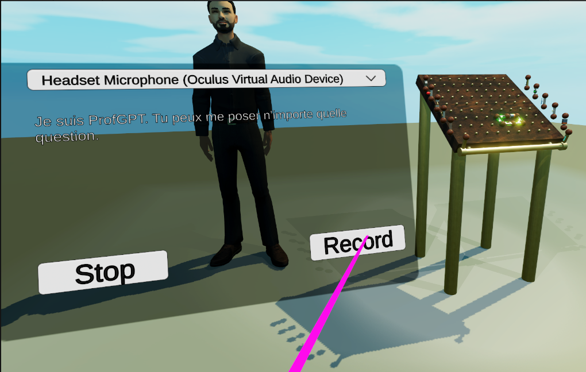
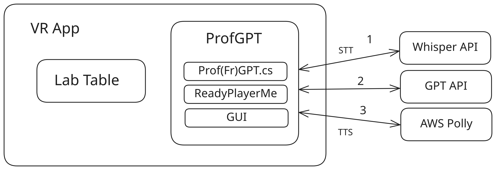
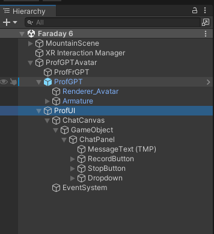
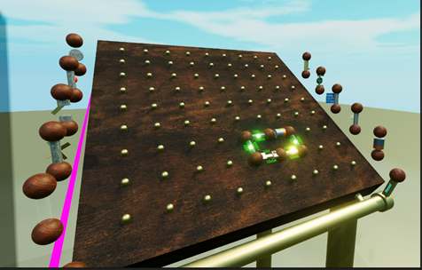
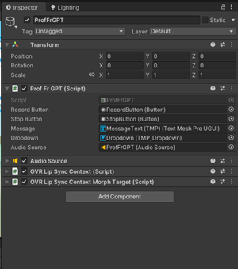
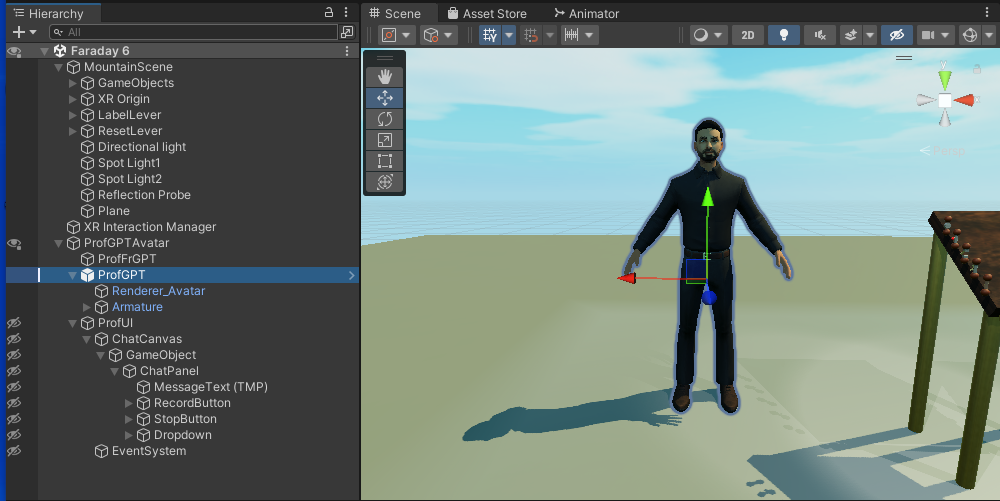
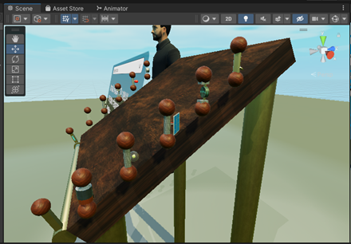

# 👨‍🏫🤖 ProfGPT: Educación en Realidad Virtual con un Profesor Virtual impulsado por IA 🧠

<br>
<div align="center">
   
   <br>
</div>
<br>

## 🎯 Descripción del Proyecto
ProfGPT es una aplicación educativa de realidad virtual (VR) desarrollada para Oculus Quest 2. Ofrece una experiencia de aprendizaje inmersiva que permite a los usuarios explorar y experimentar con circuitos eléctricos en un entorno de laboratorio virtual. El atractivo principal de la aplicación es ProfGPT, un profesor virtual impulsado por IA que guía a los usuarios a través del proceso de aprendizaje mediante interacción en lenguaje natural (inglés o francés).

<br>
<div align="center">
   
   <br>
</div>
<br>


## 🚀 Características

- 🔌 **Laboratorio Interactivo de Circuitos Eléctricos**: Experimenta con una amplia gama de componentes eléctricos para construir y explorar circuitos en un entorno 3D realista.
- 🤖 **Instructor Virtual impulsado por IA**: ProfGPT guía a los usuarios con explicaciones habladas, utilizando ChatGPT, Whisper y AWS Polly para responder preguntas.
- 🎮 **Aprendizaje Inmersivo en VR**: Diseñado para Oculus Quest 2, ofreciendo una experiencia de aprendizaje atractiva y práctica en realidad virtual.
- 🗣️ **Asistencia en Lenguaje Natural**: Las consultas por voz se procesan sin problemas a través de Whisper, ChatGPT y AWS Polly para una experiencia interactiva fluida.

## 🏗️ Arquitectura
La arquitectura de la aplicación se divide en dos componentes clave:
1. **Mesa de Laboratorio Virtual**: Un espacio donde los usuarios pueden interactuar con varios componentes eléctricos para construir circuitos.
2. **ProfGPT**: Un profesor virtual inteligente construido utilizando APIs para reconocimiento de voz, procesamiento de lenguaje natural y servicios de texto a voz.

La arquitectura aprovecha varias APIs:
- **Whisper** (voz a texto)
- **ChatGPT** (respuestas conversacionales de IA)
- **AWS Polly** (texto a voz)

<br>
<div align="center">
   
   <br>
</div>
<br>

  ## 🛠️ Implementación
ProfGPT utiliza una arquitectura modular donde cada componente es responsable de interacciones específicas:

1. **Reconocimiento de Voz**: El usuario graba su voz, que se envía a Whisper de OpenAI para su transcripción.
2. **Interacción con IA**: El texto transcrito se envía a ChatGPT para generar una respuesta.
3. **Síntesis de Voz**: La respuesta de la IA se convierte de nuevo en voz utilizando AWS Polly y se reproduce para el usuario.

<br>
<div align="center">
   
   <br>
</div>
<br>


### 🔑 Tecnologías Clave:
- **Unity** para el entorno de VR
- **Whisper y ChatGPT de OpenAI** para interacción inteligente por voz
- **AWS Polly** para síntesis de texto a voz

### 🔧 APIs y Servicios Utilizados
- **Whisper**: Convierte la entrada de audio en texto utilizando reconocimiento de voz de vanguardia.
- **AWS Polly**: Proporciona conversión de texto a voz con sonido natural para generar respuestas de ProfGPT.
- **ChatGPT**: Respuestas impulsadas por IA a las consultas de los usuarios, permitiendo interacción en lenguaje natural.

### 📦 Plugins y Paquetes
- **[ReadyPlayerMe](https://readyplayer.me/)**: Utilizado para crear el avatar de ProfGPT.
- **[OpenAI-Unity](https://github.com/srcnalt/OpenAI-Unity)**: Para integrar los modelos de OpenAI (Whisper y ChatGPT) con Unity.
- **XR Interaction Toolkit**: Facilita las interacciones dentro del entorno de VR.
- **[Mixamo](https://www.mixamo.com/)**: Proporciona animaciones para el avatar de ProfGPT.

## 🧪 Mesa de Laboratorio Virtual
La mesa de laboratorio virtual se importó desde [este repositorio](https://github.com/Schackasawa/faraday) y contiene diversos componentes para que los usuarios construyan circuitos eléctricos. Los usuarios pueden interactuar con componentes como:
- 💡 Bombillas
- 🔋 Baterías
- 🌞 Paneles Solares

Estos componentes pueden recogerse y colocarse sobre la mesa del laboratorio para formar circuitos funcionales.

<br>
<div align="center">
   
   <br>
</div>
<br>

## 🤖 ProfGPT: Avatar y Configuración
ProfGPT está diseñado utilizando la plataforma ReadyPlayerMe, y el avatar se integra con Unity a través del SDK de ReadyPlayerMe. El avatar utilizado tiene la siguiente URL glb:

```https://models.readyplayer.me/644c3d00b7a1ed40a46033c9.glb```

El avatar puede:
- Escuchar las consultas del usuario usando Whisper.
- Responder a los usuarios usando ChatGPT y AWS Polly.

Los siguientes scripts son esenciales:
- `ProfFrGPT.cs`: Gestiona las interacciones entre el usuario y ProfGPT, incluyendo el envío de audio a las APIs y el manejo de respuestas.
- `ProfUI.cs`: Gestiona la interfaz gráfica para grabar la entrada de voz y mostrar las respuestas de ProfGPT.

<br>
<div align="center">
   
   <br>
</div>
<br>

## 📸 Medios

<br>
<div align="center">
   
   <br><br>
   Se puede observar la estructura de la escena junto al avatar de ProfGPT
</div>
<br>

<br>
<div align="center">
   
   <br><br>
   ProfGPT junto a la mesa del laboratorio. Se puede formular cualquier pregunta a ProfGPT y veremos que aparece escrita en la interfaz de usuario.
</div>
<br>

<br>
<div align="center">
   
   <br><br>
   Esta es una vista lateral de la mesa del laboratorio.
</div>
<br>

## 📚 Referencias

- [Faraday Virtual Lab Table](https://github.com/Schackasawa/faraday) - Crédito al creador por proporcionar el activo de la mesa de laboratorio virtual utilizado en este proyecto.
- [OpenAI-Unity GitHub Repo](https://github.com/srcnalt/OpenAI-Unity) - Crédito al desarrollador por facilitar la integración de los modelos de OpenAI con Unity.
- [Canal de YouTube de Sgt3v](https://www.youtube.com/@sgt3v) - Agradecimiento especial a Sgt3v por proporcionar tutoriales invaluables sobre el desarrollo de NPCs inteligentes para VR impulsados por GPT. ¡Visiten su canal para ver contenido increíble!


## ⚠️ Aviso

**Este proyecto está incompleto.** El repositorio contiene todos los archivos que pude recuperar del proyecto original. Debido a la antigüedad del proyecto, es posible que algunos activos y código falten o estén desactualizados. Tenga esto en cuenta al revisar o intentar utilizar el código.
